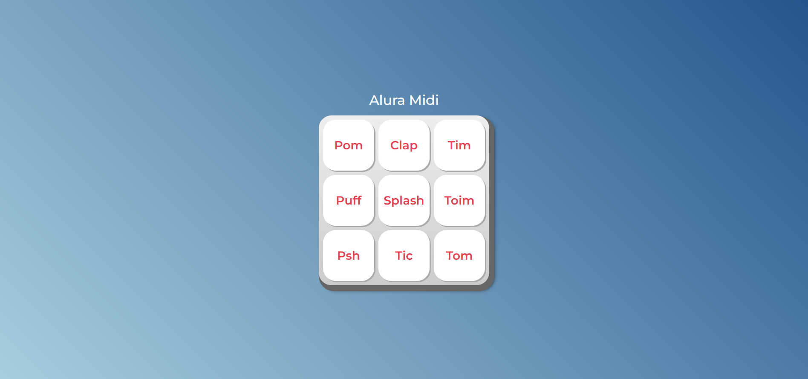

# JavaScript para Web: Crie páginas dinâmicas

## Índice
1. [Descrição do Projeto](#descrição-do-projeto)
2. [Motivação](#motivação)
3. [Funcionalidades](#funcionalidades)
4. [Instalação e Execução](#instalação-e-execução)
5. [Tecnologias Utilizadas](#tecnologias-utilizadas)
6. [Como Usar](#como-usar)
7. [Exemplos de Resultados](#exemplos-de-resultados)
8. [Próximos Passos](#próximos-passos)
9. [Referências](#referências)
10. [Licença](#licença)

## Descrição do Projeto
Este projeto tem como objetivo proporcionar uma compreensão dos papéis de cada tecnologia da Web na construção de páginas, bem como a aplicação prática de técnicas de JavaScript em conjunto com HTML e CSS para criar páginas dinâmicas e interativas.

## Motivação
Projeto desenvolvido com o intuito de aprimorar meus conhecimentos e me desenvolver na área da programação. Acredito que, ao investir tempo e esforço no estudo contínuo, poderei evoluir minhas habilidades técnicas e contribuir de forma significativa para projetos desafiadores e inovadores.

## Funcionalidades
- Identificar os papéis de cada tecnologia da Web para construção de páginas
- Associar o JavaScript com HTML através do DOM
- Implementar funções com JavaScript
- Investigar possibilidades de resolução de problemas de código
- Selecionar operadores lógicos adequados para diferentes situações
- Produzir soluções simples para páginas dinâmicas
